## Day3-Combinational and sequential optimizations


<details>
<summary> Introduction to optimizations</summary>

#### Combinational Logic Optimisation:

#### Technique used for combinatinal optimisation:
1. Constant propogation- Direct optimisation technique using boolean expression
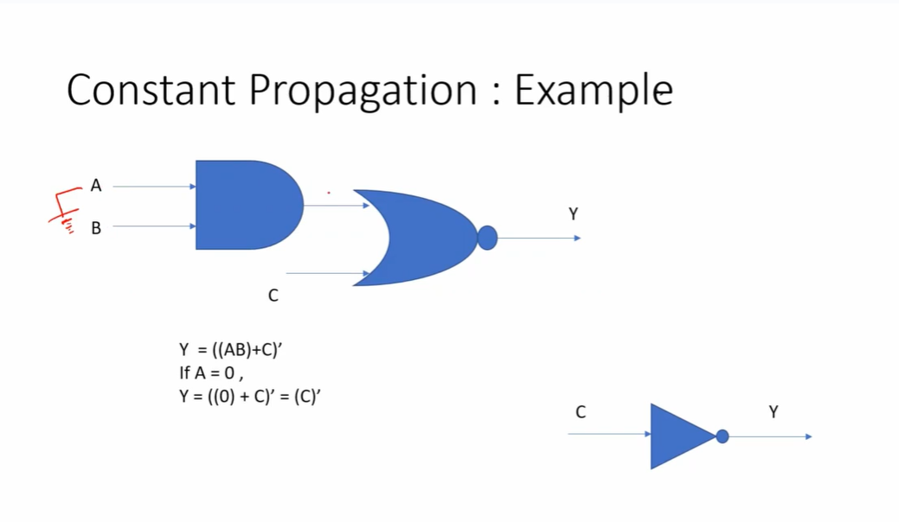

2. Boolean logic optimization- Uses  K-map and Quine Mckluskey and boolean expression  to optimize the logic
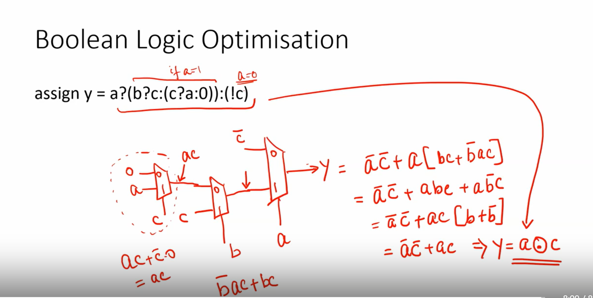


#### Sequential Logic Optimisation:
#### Basic:
1. Sequestianl constant propogation.
#### Advance:
1. State optimization.
2. Retiming.
3. Sequential logic cloning.
   
#### Sequestianl constant propogation:
Output remain constant irespective of reset and clock.


#### Advanced optimization:


</details>

<details>
<summary>Combinational Logic Optimizations</summary>

<details>
<summary>opt_check1</summary>
Steps

```
yosys
read_liberty -lib /home/dhanvanti/scl_pdk_v2/stdlib/fs120/liberty/lib_flow_ff/tsl18fs120_scl_ff.lib
read_verilog opt_check1.v
synth -top opt_check1
opt_clean -purge
abc -liberty /home/dhanvanti/scl_pdk_v2/stdlib/fs120/liberty/lib_flow_ff/tsl18fs120_scl_ff.lib
show
```
Module

```
module opt_check (input a , input b , output y);
    assign y = a ? b : 0;
endmodule
```

Synthesis result

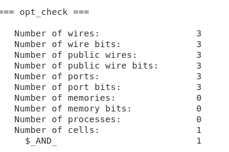

Optimization

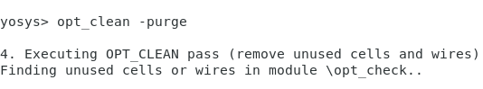

Link to Liberty File

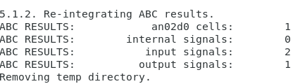

result

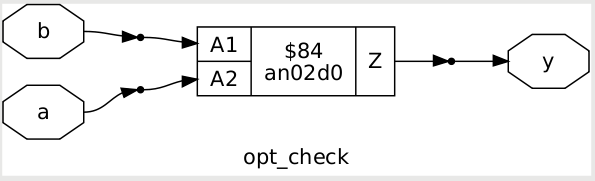
</details>

<details>
<summary>opt_check2</summary>
Steps

```
yosys
read_liberty -lib /home/dhanvanti/scl_pdk_v2/stdlib/fs120/liberty/lib_flow_ff/tsl18fs120_scl_ff.lib
read_verilog opt_check2.v
synth -top opt_check2
opt_clean -purge
abc -liberty /home/dhanvanti/scl_pdk_v2/stdlib/fs120/liberty/lib_flow_ff/tsl18fs120_scl_ff.lib
show
```
Module

```
module opt_check2 (input a , input b , output y);
    assign y = a ? 1 : b;
endmodule
```

Synthesis result


Link to Liberty File

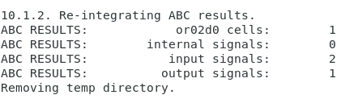

result


</details>

<details>
<summary>opt_check3</summary>
Steps

```
yosys
read_liberty -lib /home/dhanvanti/scl_pdk_v2/stdlib/fs120/liberty/lib_flow_ff/tsl18fs120_scl_ff.lib
read_verilog opt_check3.v
synth -top opt_check3
opt_clean -purge
abc -liberty /home/dhanvanti/scl_pdk_v2/stdlib/fs120/liberty/lib_flow_ff/tsl18fs120_scl_ff.lib
show
```
Module

```
module opt_check3 (input a , input b, input c , output y);
    assign y = a ? (c ? b : 0) : 0;
endmodule
```

Synthesis result

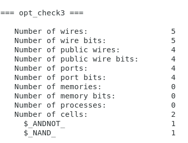


Link to Liberty File

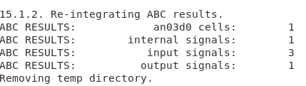

result

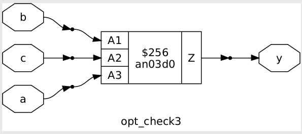
</details>


<details>
<summary>opt_check4</summary>
Steps

```
yosys
read_liberty -lib /home/dhanvanti/scl_pdk_v2/stdlib/fs120/liberty/lib_flow_ff/tsl18fs120_scl_ff.lib
read_verilog opt_check4.v
synth -top opt_check4
opt_clean -purge
abc -liberty /home/dhanvanti/scl_pdk_v2/stdlib/fs120/liberty/lib_flow_ff/tsl18fs120_scl_ff.lib
show
```
Module

```
module opt_check4 (input a , input b , input c , output y);
    assign y = a ? (b ? (a & c) : c) : (!c);
endmodule
```

Synthesis result

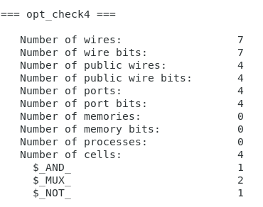


Link to Liberty File

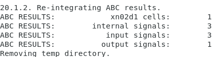

result

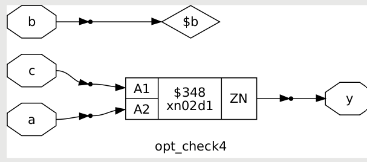
</details>
</details>

<details>
<summary>Sequential Logic Optimizations</summary>

<details>
<summary>dff_const1</summary>

Steps
```
yosys
read_liberty -lib /home/dhanvanti/scl_pdk_v2/stdlib/fs120/liberty/lib_flow_ff/tsl18fs120_scl_ff.lib
read_verilog dff_const1.v
synth -top dff_const1
dfflibmap -liberty /home/dhanvanti/scl_pdk_v2/stdlib/fs120/liberty/lib_flow_ff/tsl18fs120_scl_ff.lib
abc -liberty /home/dhanvanti/scl_pdk_v2/stdlib/fs120/liberty/lib_flow_ff/tsl18fs120_scl_ff.lib
show
```

Module 

```
module dff_const1(input clk, input reset, output reg q);
always @(posedge clk, posedge reset)
begin
	if(reset)
		q <= 1'b0;
	else
		q <= 1'b1;
end

endmodule
```
GTK waveform

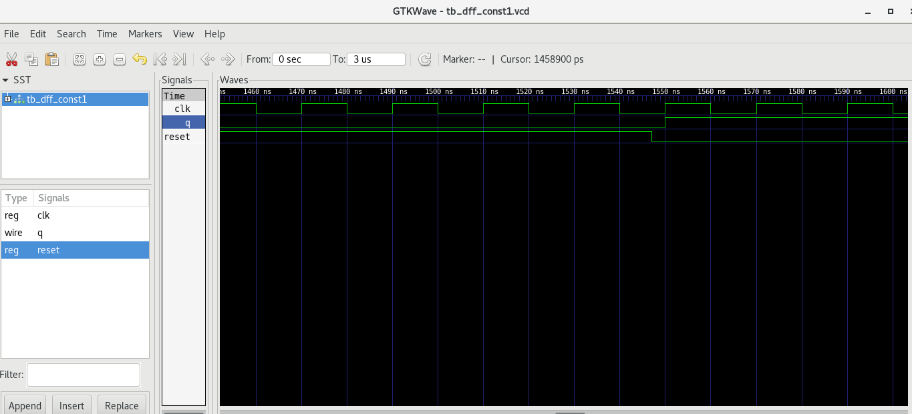

Synthesis result

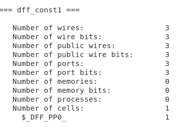

Optimization

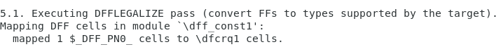

Link to Liberty File

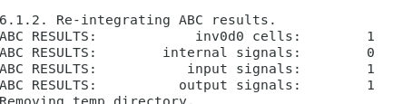

Result

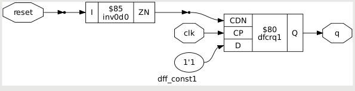

</details>

<details>
<summary>dff_const2</summary>

Steps
```
yosys
read_liberty -lib /home/dhanvanti/scl_pdk_v2/stdlib/fs120/liberty/lib_flow_ff/tsl18fs120_scl_ff.lib
read_verilog dff_const2.v
synth -top dff_const2
dfflibmap -liberty /home/dhanvanti/scl_pdk_v2/stdlib/fs120/liberty/lib_flow_ff/tsl18fs120_scl_ff.lib
abc -liberty /home/dhanvanti/scl_pdk_v2/stdlib/fs120/liberty/lib_flow_ff/tsl18fs120_scl_ff.lib
show
```

Module 

```
module dff_const2(input clk, input reset, output reg q);
always @(posedge clk, posedge reset)
begin
	if(reset)
		q <= 1'b1;
	else
		q <= 1'b1;
end

endmodule
```
GTK waveform

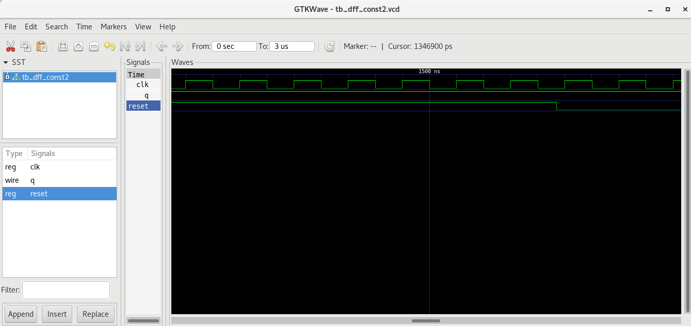

Synthesis result

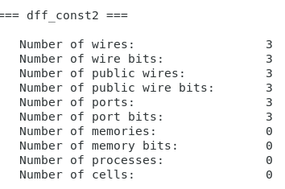

Optimization

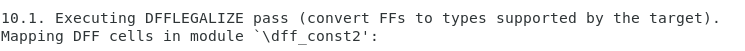

Link to Liberty File

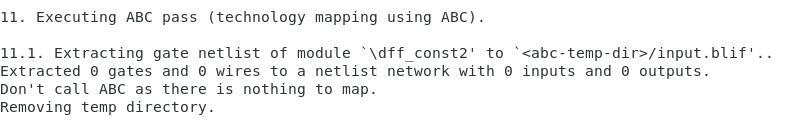

Result

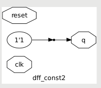

</details>

<details>
<summary>dff_const3</summary>

Steps
```
yosys
read_liberty -lib /home/dhanvanti/scl_pdk_v2/stdlib/fs120/liberty/lib_flow_ff/tsl18fs120_scl_ff.lib
read_verilog dff_const3.v
synth -top dff_const3
dfflibmap -liberty /home/dhanvanti/scl_pdk_v2/stdlib/fs120/liberty/lib_flow_ff/tsl18fs120_scl_ff.lib
abc -liberty /home/dhanvanti/scl_pdk_v2/stdlib/fs120/liberty/lib_flow_ff/tsl18fs120_scl_ff.lib
show
```

Module 

```
module dff_const3(input clk, input reset, output reg q);
reg q1;

always @(posedge clk, posedge reset)
begin
	if(reset)
	begin
		q <= 1'b1;
		q1 <= 1'b0;
	end
	else
	begin
		q1 <= 1'b1;
		q <= q1;
	end
end

endmodule
```
GTK waveform

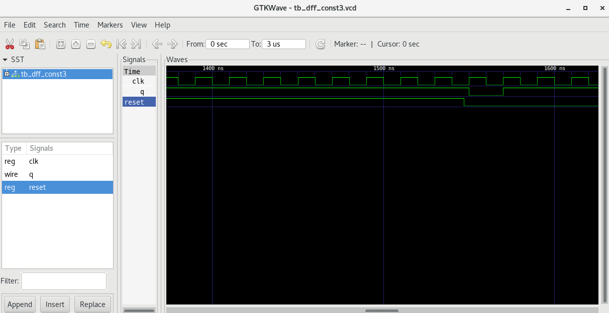

Synthesis result

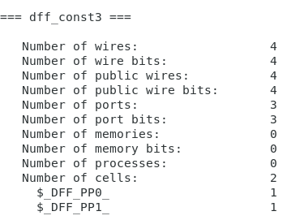

Optimization

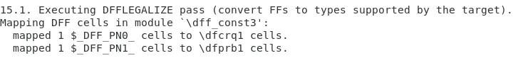

Link to Liberty File

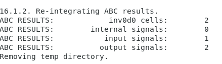

Result

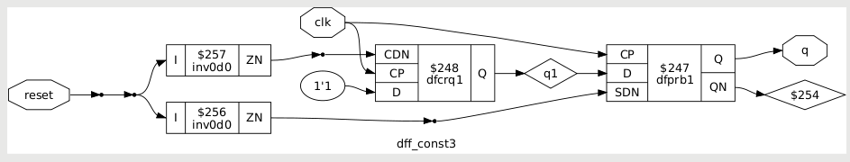

</details>

<details>
<summary>dff_const4</summary>

Steps
```
yosys
read_liberty -lib /home/dhanvanti/scl_pdk_v2/stdlib/fs120/liberty/lib_flow_ff/tsl18fs120_scl_ff.lib
read_verilog dff_const4.v
synth -top dff_const4
dfflibmap -liberty /home/dhanvanti/scl_pdk_v2/stdlib/fs120/liberty/lib_flow_ff/tsl18fs120_scl_ff.lib
abc -liberty /home/dhanvanti/scl_pdk_v2/stdlib/fs120/liberty/lib_flow_ff/tsl18fs120_scl_ff.lib
show
```

Module 

```
module dff_const4(input clk, input reset, output reg q);
reg q1;

always @(posedge clk, posedge reset)
begin
	if(reset)
	begin
		q <= 1'b1;
		q1 <= 1'b1;
	end
	else
	begin
		q1 <= 1'b1;
		q <= q1;
	end
end

endmodule
```
GTK waveform

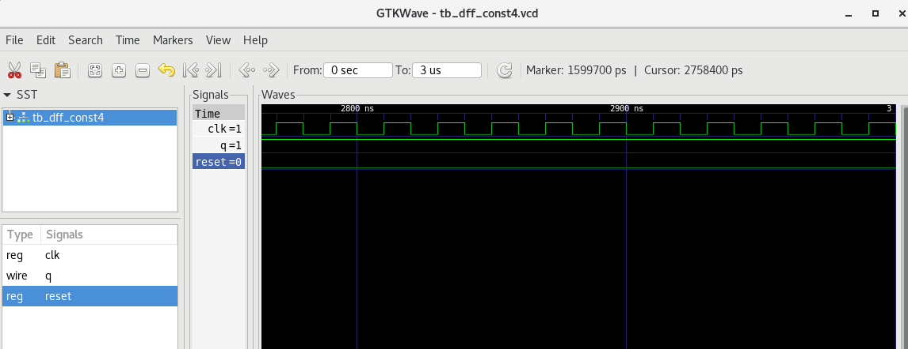

Synthesis result

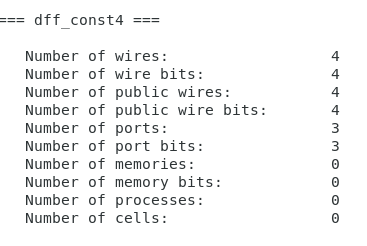

Optimization

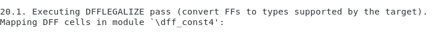

Link to Liberty File


Result

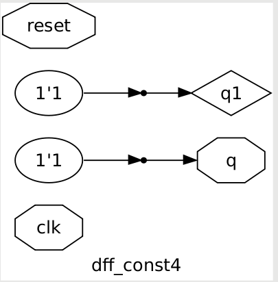

</details>

<details>
<summary>dff_const5</summary>

Steps
```
yosys
read_liberty -lib /home/dhanvanti/scl_pdk_v2/stdlib/fs120/liberty/lib_flow_ff/tsl18fs120_scl_ff.lib
read_verilog dff_const5.v
synth -top dff_const5
dfflibmap -liberty /home/dhanvanti/scl_pdk_v2/stdlib/fs120/liberty/lib_flow_ff/tsl18fs120_scl_ff.lib
abc -liberty /home/dhanvanti/scl_pdk_v2/stdlib/fs120/liberty/lib_flow_ff/tsl18fs120_scl_ff.lib
show
```

Module 

```
module dff_const5(input clk, input reset, output reg q);
reg q1;

always @(posedge clk, posedge reset)
begin
	if(reset)
	begin
		q <= 1'b0;
		q1 <= 1'b0;
	end
	else
	begin
		q1 <= 1'b1;
		q <= q1;
	end
end

endmodule
```
GTK waveform

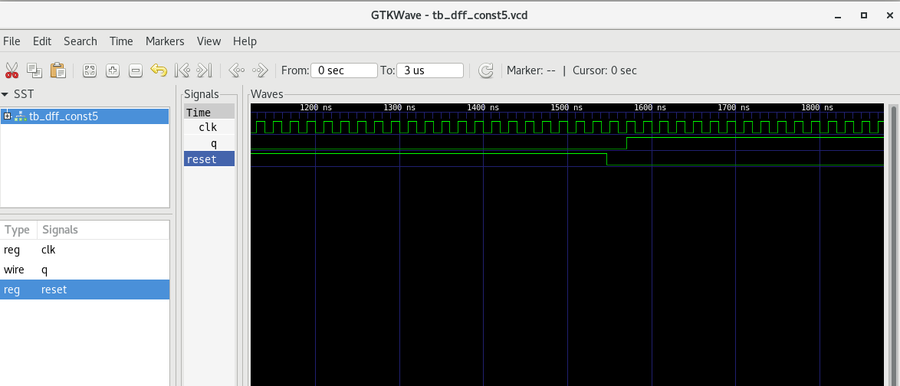

Synthesis result

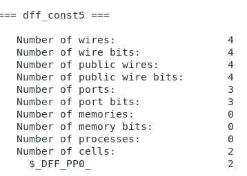

Optimization

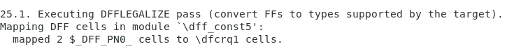

Link to Liberty File

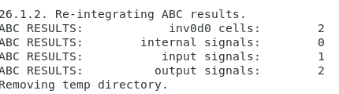

Result

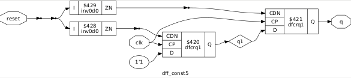

</details>
</details>

<details>
<summary>Sequential Optimizations for Unused Outputs</summary>
<details>
<summary>counter_opt</summary>

Steps
```
yosys
read_liberty -lib /home/dhanvanti/scl_pdk_v2/stdlib/fs120/liberty/lib_flow_ff/tsl18fs120_scl_ff.lib
read_verilog counter_opt.v
synth -top counter_opt
dfflibmap -liberty /home/dhanvanti/scl_pdk_v2/stdlib/fs120/liberty/lib_flow_ff/tsl18fs120_scl_ff.lib
abc -liberty /home/dhanvanti/scl_pdk_v2/stdlib/fs120/liberty/lib_flow_ff/tsl18fs120_scl_ff.lib
show
```

Module 

```
module counter_opt (input clk , input reset , output q);
reg [2:0] count;
assign q = count[0];

always @(posedge clk ,posedge reset)
begin
	if(reset)
		count <= 3'b000;
	else
		count <= count + 1;
end

endmodule
```
GTK waveform

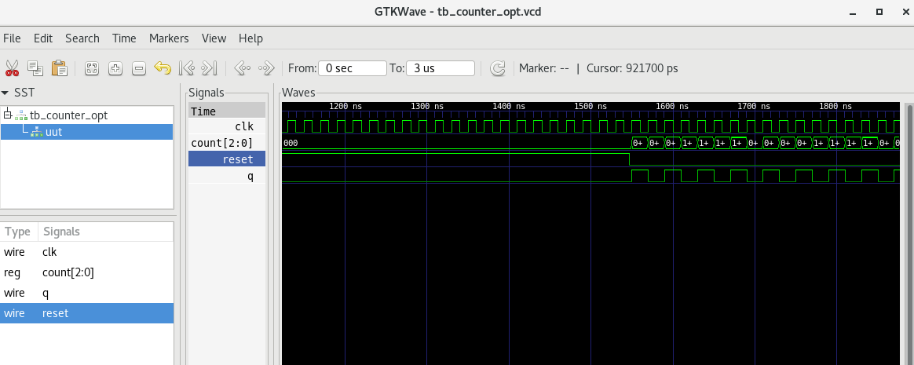

Synthesis result

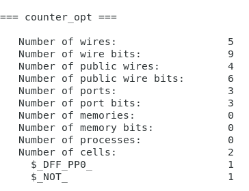

Optimization

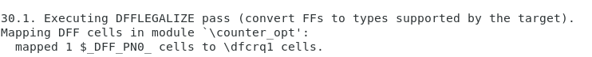

Link to Liberty File


Result

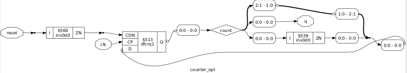

</details>
</details>
