## Day4- GLS, Blocking vs Non-blocking, and Synthesis-Simulation Mismatch
<details>
<summary>GLS, Synthesis-Simulation Mismatch, and Blocking/Non-blocking Statements</summary>

### GLS Concept anf Flow using Iverilog
GLS stands for Global Netlist Synthesis. While RTL simulation occurs before synthesis, GLS take place after synthesis.\
Gate-Level Simulation (GLS) is performed on a synthesized netlist to ensure that:

1. The synthesized design aligns with the intended RTL (Register Transfer Level) functionality.
2. Timing behavior is correct when using real gate delays.
3. Design constraints such as setup and hold times are met.

The GLS flow using iverilog is as follows:
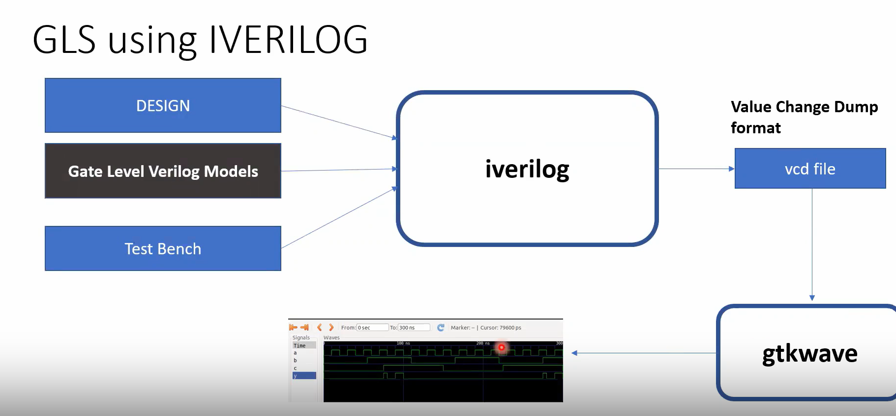

```Note:If the gate level models are delay annoted, then we can use for timing validation.```

Gate-Level Simulation (GLS) comes in two main types:

1. Timing-Aware GLS (Back-Annotated)\
*Purpose*: Verifies both functionality and timing delays.\
*Details*: Uses delays from timing files (SDF) to mimic real hardware behavior, helping catch setup/hold violations.\
*Use Case*: Used post-synthesis for final timing verification, though slower due to detailed timing modeling.
2. Functional GLS (Zero-Delay)\
*Purpose*: Focuses on checking logical correctness without timing.\
*Details*: Runs with zero-delay gates, making it faster but ignoring timing effects.\
*Use Case*: Used immediately after synthesis to confirm functional equivalency to the RTL design

### Synthesis-Simulation Mismatch
It occurs when the behavior of a synthesized gate-level netlist (GLS) does not match the original RTL simulation.

A simulation mismatch can occur due to several coding and synthesis-related factors. Here are the primary reasons:

1. Missing Sensitivity List\
Cause: If an RTL process (such as an always block) lacks a complete sensitivity list, it may not trigger correctly during simulation, leading to discrepancies in behavior.\
Example: In an always block for combinational logic, omitting a signal from the sensitivity list means that changes to that signal won’t trigger the block, resulting in simulation mismatches.\
Solution: Use always @(*) for combinational logic or ensure the sensitivity list is correctly specified.

2. Blocking vs. Non-Blocking Assignments\
Cause: Incorrect use of blocking (=) and non-blocking (<=) assignments can lead to different simulation results, especially in sequential logic.\
Example: Using blocking assignments in a clocked always block can cause unexpected sequential behavior because it updates signals immediately instead of waiting for the next clock cycle.\
Solution: 
Non-blocking (<=) assignments for sequential logic.\
Blocking (=) assignments for combinational logic.


3. Non-Standard Verilog Coding\
Cause: Using non-standard or unconventional Verilog code (such as certain coding styles, implicit latches, or vendor-specific constructs) can lead to inconsistent synthesis and simulation results.\
Example: Leaving variables unassigned in certain branches of a combinational always block can inadvertently create latches, resulting in mismatches.\
Solution: Follow standard Verilog coding guidelines to ensure consistency, avoid inferred latches, and explicitly define all signal paths.

4. Caveats with Blocking Statements
 *Cause*:Incorrect use of blocking statements\
 *Solution*:Use non-blocking statements for sequential logic.

</details>

<details>
<summary>Labs on GLS and Synthesis-Simulation Mismatch</summary>

1. ternary_operator_mux.v

RTL Simulation

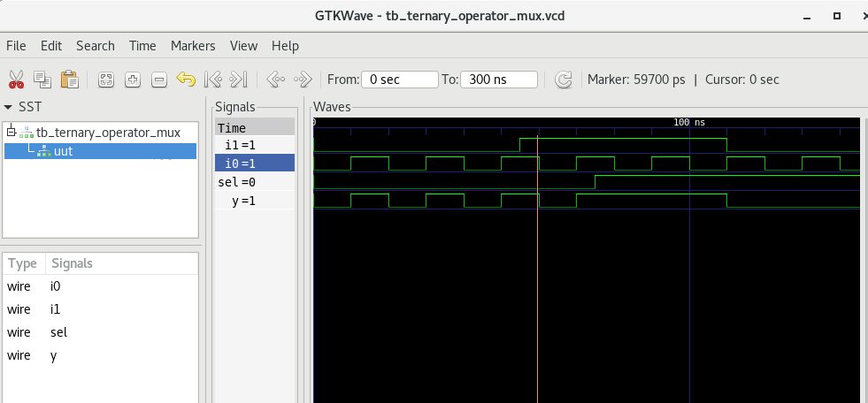

Synthesis
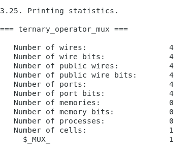

Link to Liberty File

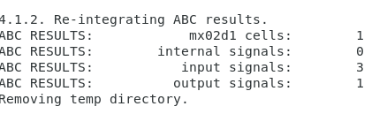

Output


GLS Output

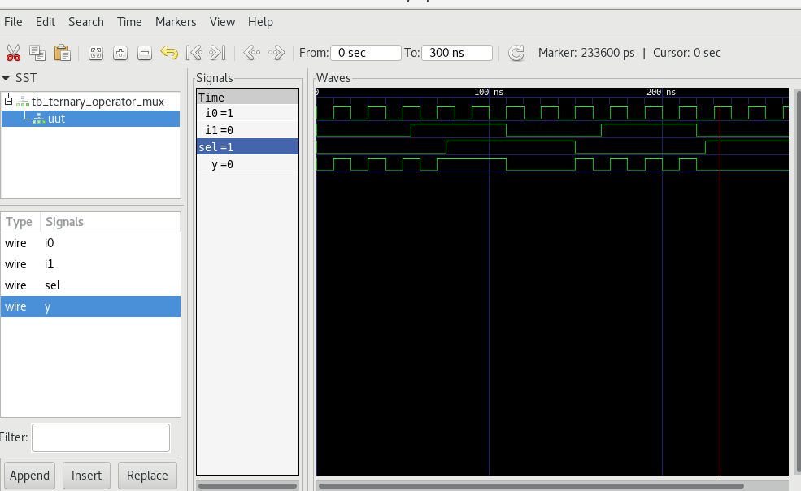

2. bad_mux.v

RTL Simulation

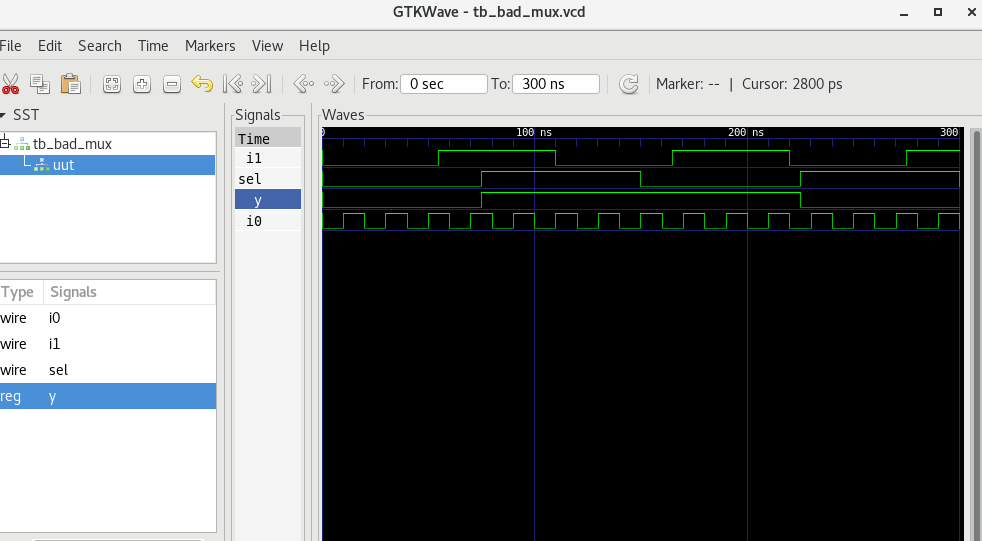

Synthesis

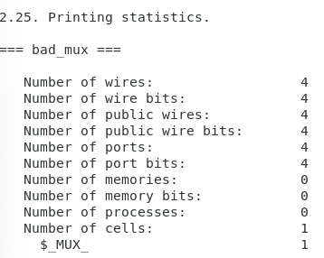

Link to Liberty File

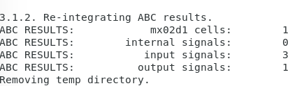

Output

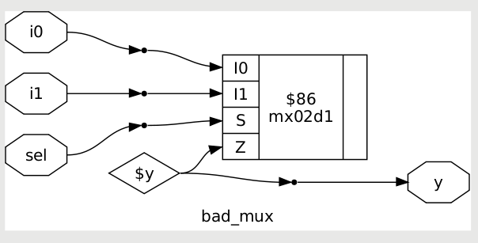

GLS Output


</details>

<details>
<summary>Labs on Synth-Sim Mismatch for Blocking Statement</summary>

#### blocking_caveat


Synthesis

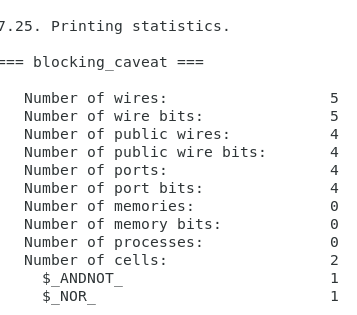

Link to Liberty File

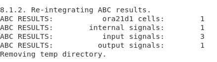

Output

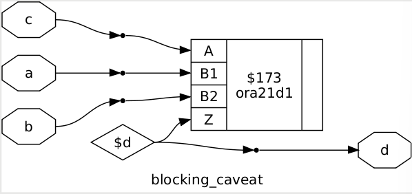

GLS Output

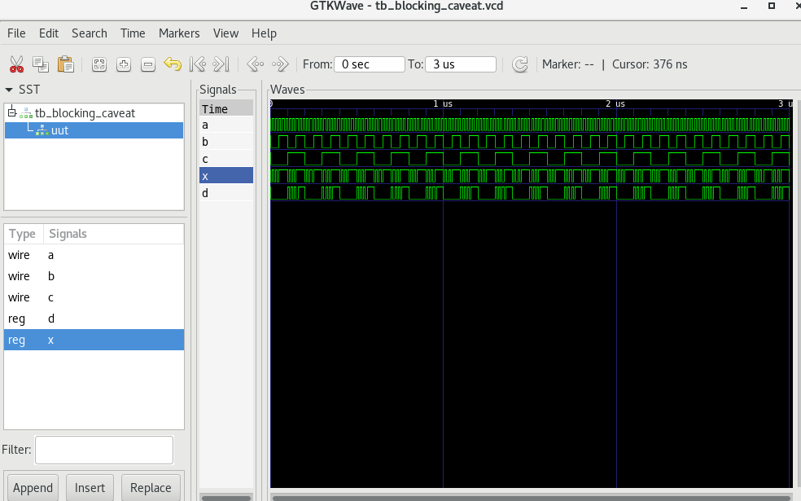

</details>