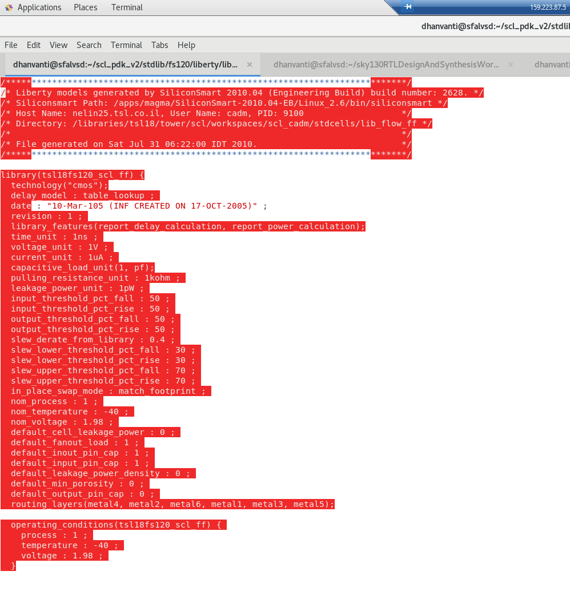

## Introduction to Logic Synthesis

Logic Synthesis converts high-level design specifications (e.g., in Verilog) into gate-level implementations, aiming to optimize for area, timing, and power.

Example Verilog code for synthesis:
```
module model_code (input a, input b, input c, output z);
assign y = (a & b) | (b & c) | (c & a);
endmodule
```

#### Key Considerations:

Different implementations may be functionally correct, but choosing the best one depends on area, delay, and design constraints.

Constraints guide the synthesis tool to pick suitable library cells that align with design goals.


#### Setting up Synopsys Design Compiler (DC)
Design Compiler (DC) is a widely used synthesis tool in ASIC design.

File Types:
.lib: Standard cell libraries.\
.db: Binary format libraries for DC.\
.ddc: Synopsys proprietary format to store design information.\
SDC (Synopsys Design Constraints): Specifies timing, area, and power constraints.


### PDK Utilized:- SCL180
library:- tsl18fs120_scl_ff
characteristics:-



### Getting started with DC shell
#### Steps to Invoke DC Shell

```
csh
dc_shell
```
checkout list of all loaded tools


#### Loading verilog without configurations with dummy libraries
Initially no libraries are loaded in DC shell verilog is loaded with dummy libraaries

To check linked and target libraries
```
echo $taget_library
echo $link_library
```

To load verilog file
```
read_verilog <path_to_verilog_file>
```


#### Generted respoonse from dummy library SEQGEN


#### Reading and linking Liberty Libraries and compiling loaded verilog files
```
read_db <path_to_database>
set target_library <path_to_target_library>
set link_library {* <path_to_link_library>}

link
compile
```


compile
#### Verilog output Generated with SCL PDK
Design file clearly shoows different cells used


### Storing Output
store verilog output to a file for c shell use(opensource, can also be use with other tools)
```
write -format verilog -output <output_filename>.v
```

store .ddc file which is a proprietory Synopsys storage type for Design Vision
```
write -format ddc -output <output_filename>.ddc
```

#### Start gui with design vision
```
design_vision
```

displaying our .ddc stored file in deesign vision\
Image clearly shows cells used to create the circuit


### Setting up DC shell environment  
1. Create `.synopsys_c.setup` file, 
2. add target_library command 
3. add link library commnd 

This will automatically load the libraries to dc shell on loadingnew shell


