## Day6- Basics of STA 
### What is STA

Static Timing Analysis (STA) is a fundamental technique in the design verification of digital circuits, The process involves analyzing critical paths and setup and hold times to confirm that each signal arrives within the required timing constraints, thus guaranteeing reliable performance at the target clock frequency. Timing constraints, such as clock period, clock skew, and clock jitter, define the speed and stability of the circuit and are essential for accurate synchronization of signals. STA checks these constraints to confirm that no paths exceed the maximum allowable delay and that signals are stable when captured, thus verifying that the synthesized circuit will function correctly under real-world operating conditions.

### What are Constraints?
**Setup Constraint**
The setup time is the minimum period before a clock edge when the data input must remain stable for reliable latching. If the data signal changes too close to the clock edge, it can violate the setup constraint, leading to incorrect data capture. STA verifies that each data path—from the launch flip-flop to the capture flip-flop—provides adequate time for data to propagate and stabilize before the clock edge. To fix setup violations, designers may reduce logic delays, increase the clock period, or adjust interconnect delays.

**Hold Constraint**
The hold time is the minimum duration after a clock edge that data must stay stable to ensure correct latching. A hold violation happens when data changes too quickly after the clock edge, potentially interfering with the next clock cycle. STA checks that each path has enough delay to keep the data stable immediately after the clock edge. Adding delay buffers along the path can help to meet hold constraints by ensuring data does not change prematurely.


### Timing Paths

1. Rigister-to-register paths- Link flip-flops (or registers), where data moves from one flip-flop to another on each clock cycle

2. Input-to-Register Paths: Determine how fast an external input signal can reach a flip-flop, ensure the data is available within the timing constaint.

3. Register-to-Output Paths: shows how data can propagate from internal registers to the circuit's output.

4. Input-to-Output Paths:  combinational paths connect an input port directly to an output port. 

### Input Transition & Output Load

I/O constraints in STA ensure the proper timing of signals between the chip's I/O pins and internal logic. It includes:

1. **Input Arrival Time**: Specifies the latest time by which input signals must arrive at the I/O pins.

2. **Output Required Time:** Defines the minimum time after a clock edge for the output signals to be stable.

3. **I/O Delay Modeling:** Accounts for the delays in signal propagation from/to internal logic and I/O pins.

## Timing .libs and Exploration

### Timing .libs
Structure of .lib Files:

- **Library Information:** Details on technology, process corners, and voltage/temperature conditions.

- **Cell Definitions:** Information on individual cells like AND gates or flip-flops.

- **Timing Data:** Includes input/output delays, transition times, setup/hold times, and clock characteristics.

- **Power and Area:** Power consumption and area details for optimization.

- **Operating Conditions:** Defines how cells behave under varying conditions.

Use the following command to see the sequential cells in the libraries
```
get_lib_cells */* -filter "is_sequential==true"
```
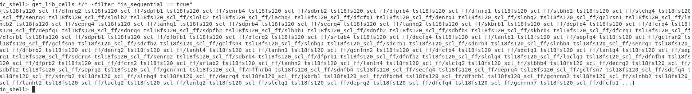

List all loaded libraries

```
list_lib
```

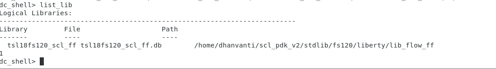

### Exploring dotLib

Get the cells containing 'or'
```
get_lib_cells */*or*
```
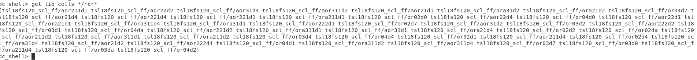

We can use loop for the each cell

```
foreach in collection my lib cell [get lib cells */*or*] {
  set my_lib_cell_name [get_object_name $my_lib_cell];
  echo $my_lib_cell;
}
```
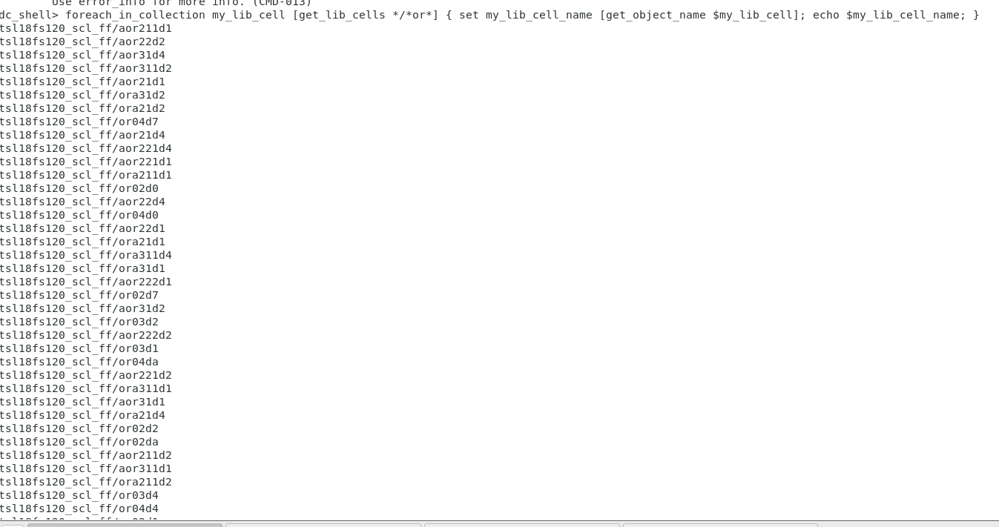

```
get_lib_pins tsl18fs120_scl_ff/or03do/*
get_lib_attribute <cellname>/* <attribute>
```
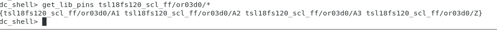
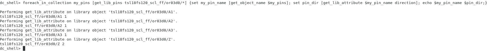
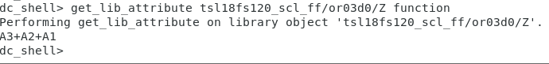

Edit tcl file and source it and check all the attributes

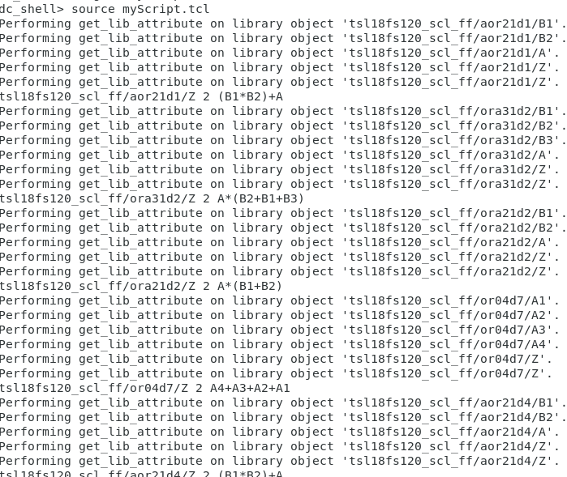
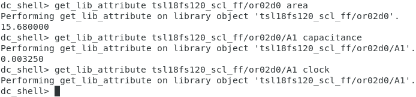
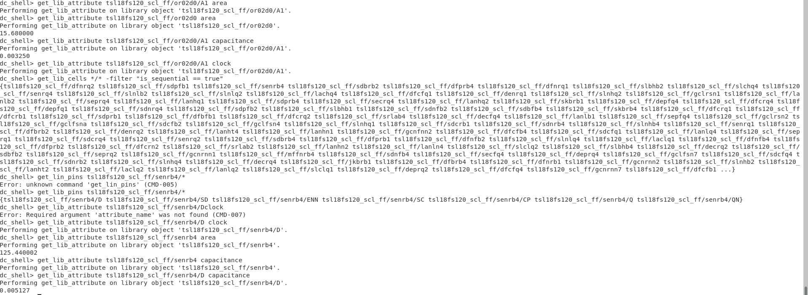

We can list all the attributes using 

```
list_attribute -app
```
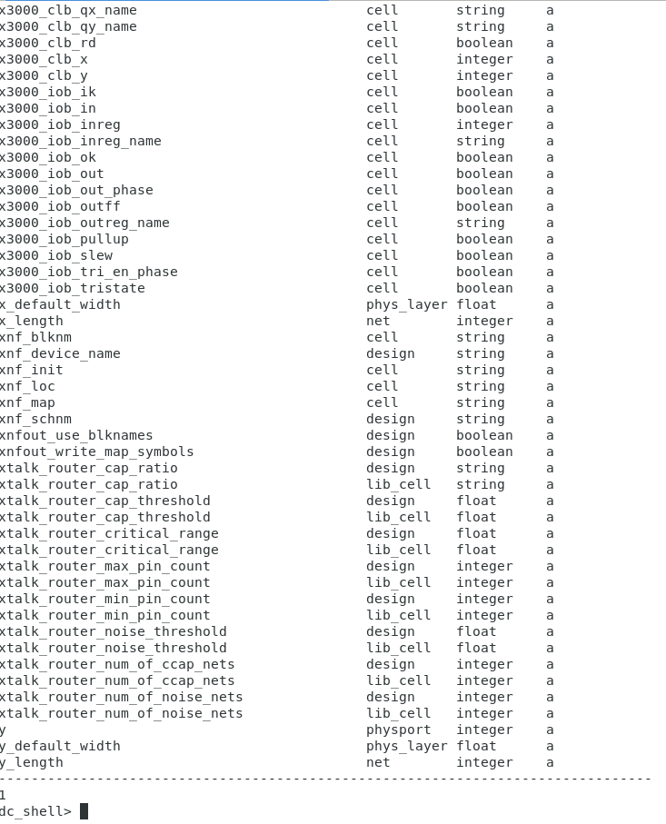

