# SFAL SOC Design Journey
## Day0
### Digital VLSI SOC Design and Planning

The image explains a high-level overview of the System-on-Chip (SoC) design flow, breaking down the key stages involved in the process from chip modeling to RTL (Register Transfer Level) design and eventual SoC integration. Let's see the overall process:

1. **Chip Modeling (O1)**
   - **Specs (C Model)**: The process begins with specifying the system's design using a high-level C model. This is where the functional behavior of the chip is modeled and tested using a C-based testbench.
   - The **C model** represents the initial step for verifying the architecture before translating it into hardware.

2. **RTL Architect (O2)**
   - **Soft Copy of Hardware Using RTL (Verilog)**: Once the high-level specifications are verified, the design moves to the RTL phase. At this stage, the hardware design is described using RTL (often in Verilog). This stage produces a soft copy of the hardware.
   - The design is split into components like **Processors**, **Peripherals/IPs**, and other logic blocks.

3. **Synthesis and SoC Design**
   - The RTL is synthesized to produce gate-level netlists. There are several synthesized components:
     - **Gate Level Netlist (Synth P1)**: The processor and peripheral IP blocks are converted into a gate-level design.
     - **Macros (Synth RTL)**: Pre-designed blocks or **Macros** (such as memory blocks or custom logic) are synthesized from RTL.
     - **Analog IPs (Func RTL)**: Some analog components are also designed and integrated at this stage.
   
4. **SoC Integration (O3)**
   - After synthesis, the next step is **SoC integration**, where all the digital and analog blocks are connected together, including GPIOs (General Purpose Input/Output). This is the stage where components like processors and IPs are assembled into a complete chip.
   - Physical design tasks like **floorplanning**, **placement**, **clock tree synthesis (CTS)**, and **routing** are performed, ensuring that all blocks are physically laid out on the chip.

5. **Floorplanning and Macros**
   - In this step, **macros and analog IP libraries** are hardened into fixed layouts (known as **hard macros** or HM). The processor can sometimes be hard macro as well, depending on the design.
   - The layout also involves defining the placement of each block and ensuring proper routing of signals.

### Tools Installtion
## Yosys
```
$ git clone https://github.com/YosysHQ/yosys.git
$ cd yosys 
$ sudo apt install make (If make is not installed please install it) 
$ sudo apt-get install build-essential clang bison flex \
    libreadline-dev gawk tcl-dev libffi-dev git \
    graphviz xdot pkg-config python3 libboost-system-dev \
    libboost-python-dev libboost-filesystem-dev zlib1g-dev
$ make 
$ sudo make install
```

## Iverilog
```
$ sudo apt-get install iverilog
```

## GTKWave
```
$ sudo apt update
$ sudo apt install gtkwave
```

## Day 2
### Timing Libraries, Hierarchical vs Flat Synthesis, and Efficient Flop Coding Styles
#### Introduction to timing.libs
The sky130_fd_sc_hd__tt_025C_1v80.lib timing library is part of the SkyWater 130nm PDK
- **sky130**: Refers to the SkyWater 130nm technology node.
- **fd_sc_hd**: Specifies the "fully-depleted standard cell, high-density" library.
- **tt_025C**: Stands for "typical-typical" process corner at 25°C.
- **1v80**: Represents the nominal voltage, 1.8V

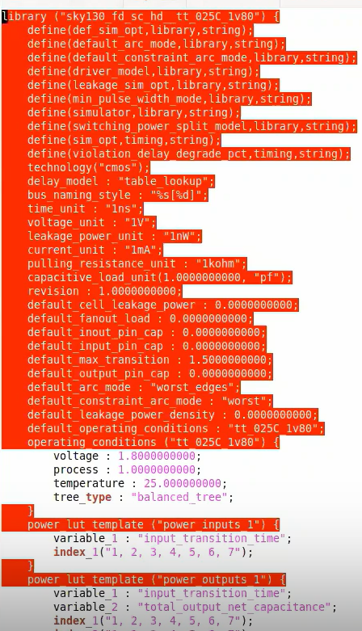

#### Undestanding the cells
A cell in the sky130_fd_sc_hd_tt_025C_1v80.lib timing library includes:
```
Power: Leakage and dynamic power, with look-up tables for power based on input transitions and capacitance.
Area: Physical cell area in square microns, crucial for layout planning.
Timing: Delay, setup, hold times, and timing arcs for input-output relationships.
Capacitance: Input/output pin capacitance impacting speed and loading.
Functionality: Logic function (e.g., AND, OR) and drive strength (e.g., NAND2_X1).
```
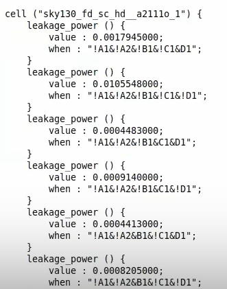
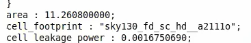
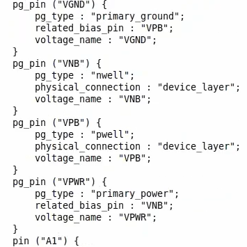

### Hierarchial vs Flat Synthesis
In Hietarchial synthesis, each module in the design is synthesized individually, then combined at higher levels.
In Flat synthesis, the entire design is synthesized at once, without hierarchical decomposition.

#### Hierarchial Synthesis
Steps
```
# Invoke yosys
yosys 

# Read liberty files
read_liberty -lib /home/dhanvanti/scl_pdk_v2/stdlib/fs120/liberty/lib_flow_ff/tsl18fs120_scl_ff.lib 

# Read verilog files
read_verilog multiple_modules.v

# Run synthesis on top level module
synth -top multiple_modules

# logic optimization using ABC algorithm
abc -liberty /home/dhanvanti/scl_pdk_v2/stdlib/fs120/liberty/lib_flow_ff/tsl18fs120_scl_ff.lib

#show the module
show
```

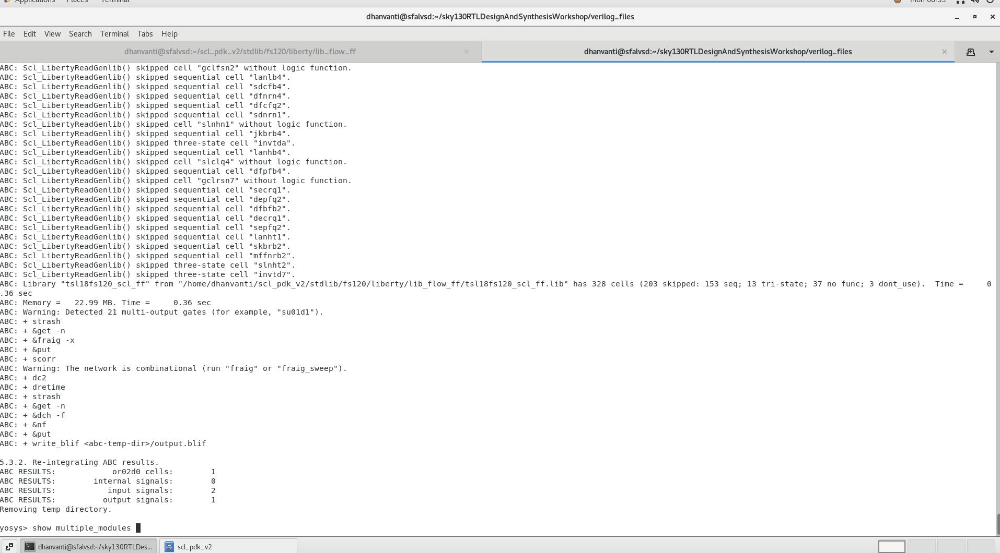

Output


#### Flat Synthesis
Steps
```
flatten
write_verilog -noattr multiple_module_flat.v
!gvim multiple_module_flat.v
```


#### Submudule level Synthesis
Repeat the above steps and do the synthesis for sub_module1

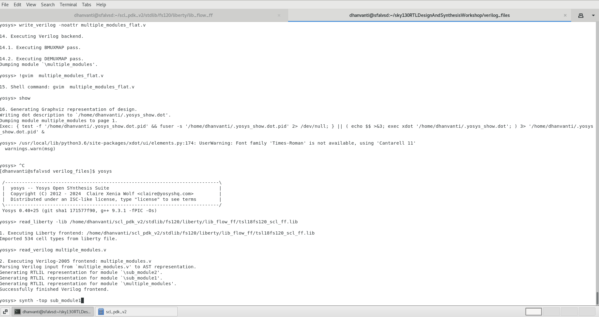


### Flop Coding Styles
Flops are important to minimize the glitches.
Here we are going to see various flip flops and its coding

1. dff_asyncres.v

```
module dff_asyncres ( input clk ,  input async_reset , input d , output reg q );
always @ (posedge clk , posedge async_reset)
begin
  if(async_reset)
  	q <= 1'b0;
  else	
  	q <= d;
end
endmodule
```


2. dff_async_set.v
```
module dff_async_set ( input clk ,  input async_set , input d , output reg q );
always @ (posedge clk , posedge async_set)
begin
	if(async_set)
		q <= 1'b1;
	else	
		q <= d;
end
endmodule
```

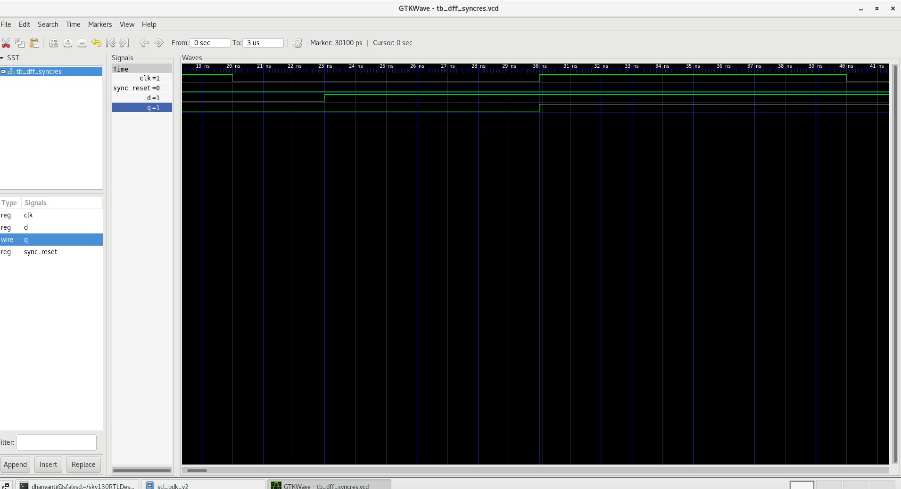

#### Flop Synthesis

```
invoke yosys
read_verilog dff_asyncres.v
Define the module to be synthesized
```
1. dff_asyncres.v


2. dff_async_set.v

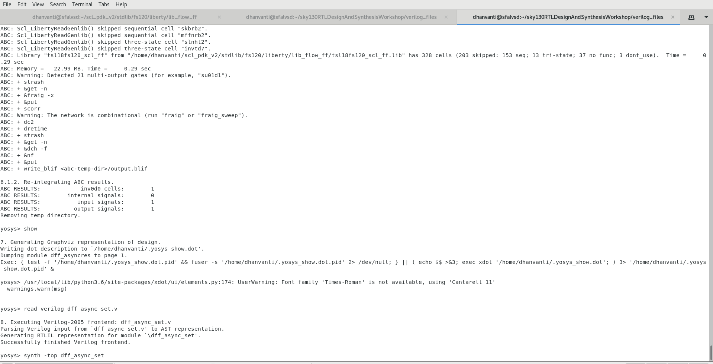


3. dff_syncres.v


#### Special Case Optimization


1. mul2 Synthesis
```
read_verilog mult_2.v
synth -top mult2
```
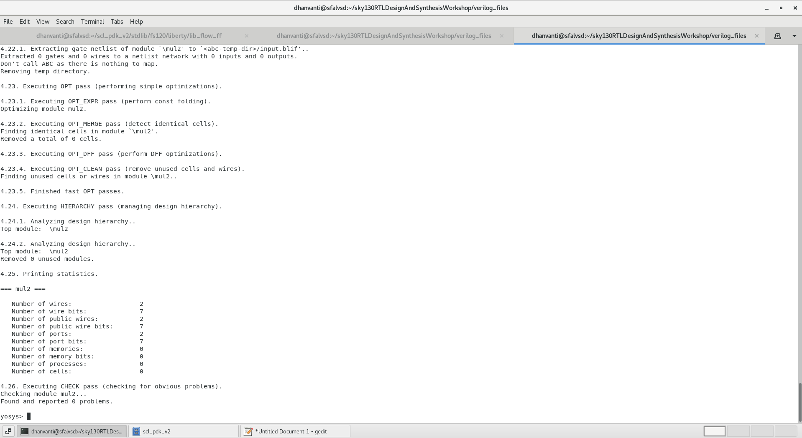


2. mul8 Synthesis
```
read_verilog mult_8.v
synth -top mult8
```
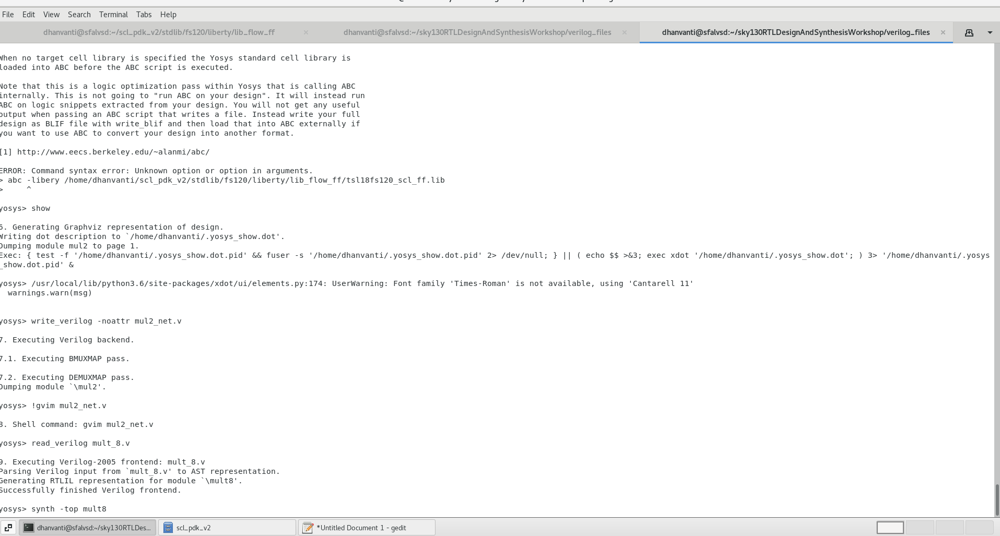
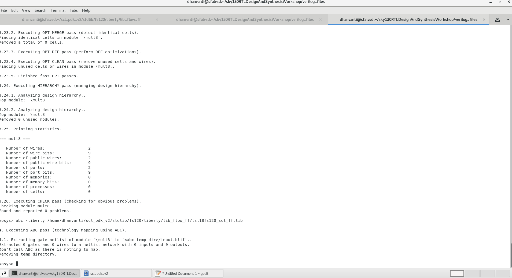


