# SFAL SOC Design Journey
## Day0
### Digital VLSI SOC Design and Planning

The image explains a high-level overview of the System-on-Chip (SoC) design flow, breaking down the key stages involved in the process from chip modeling to RTL (Register Transfer Level) design and eventual SoC integration. Let's see the overall process:

1. **Chip Modeling (O1)**
   - **Specs (C Model)**: The process begins with specifying the system's design using a high-level C model. This is where the functional behavior of the chip is modeled and tested using a C-based testbench.
   - The **C model** represents the initial step for verifying the architecture before translating it into hardware.

2. **RTL Architect (O2)**
   - **Soft Copy of Hardware Using RTL (Verilog)**: Once the high-level specifications are verified, the design moves to the RTL phase. At this stage, the hardware design is described using RTL (often in Verilog). This stage produces a soft copy of the hardware.
   - The design is split into components like **Processors**, **Peripherals/IPs**, and other logic blocks.

3. **Synthesis and SoC Design**
   - The RTL is synthesized to produce gate-level netlists. There are several synthesized components:
     - **Gate Level Netlist (Synth P1)**: The processor and peripheral IP blocks are converted into a gate-level design.
     - **Macros (Synth RTL)**: Pre-designed blocks or **Macros** (such as memory blocks or custom logic) are synthesized from RTL.
     - **Analog IPs (Func RTL)**: Some analog components are also designed and integrated at this stage.
   
4. **SoC Integration (O3)**
   - After synthesis, the next step is **SoC integration**, where all the digital and analog blocks are connected together, including GPIOs (General Purpose Input/Output). This is the stage where components like processors and IPs are assembled into a complete chip.
   - Physical design tasks like **floorplanning**, **placement**, **clock tree synthesis (CTS)**, and **routing** are performed, ensuring that all blocks are physically laid out on the chip.

5. **Floorplanning and Macros**
   - In this step, **macros and analog IP libraries** are hardened into fixed layouts (known as **hard macros** or HM). The processor can sometimes be hard macro as well, depending on the design.
   - The layout also involves defining the placement of each block and ensuring proper routing of signals.

### Tools Installtion
## Yosys
```
$ git clone https://github.com/YosysHQ/yosys.git
$ cd yosys 
$ sudo apt install make (If make is not installed please install it) 
$ sudo apt-get install build-essential clang bison flex \
    libreadline-dev gawk tcl-dev libffi-dev git \
    graphviz xdot pkg-config python3 libboost-system-dev \
    libboost-python-dev libboost-filesystem-dev zlib1g-dev
$ make 
$ sudo make install
```

## Iverilog
```
$ sudo apt-get install iverilog
```

## GTKWave
```
$ sudo apt update
$ sudo apt install gtkwave
```
## Day1
### Introduction to verilog RTL design and Synthesis
- **RTL Design**: It is a method to describe digital circuits, focusing on data flow between registers and logical operations per clock cycle.Using HDLs like Verilog or VHDL, RTL specifies how data moves and transforms in sync with the clock.

### Introduction to open Source simulator iverilog
**Simulator**: It is a software tool that decides the begaviour of a digital circuit, allowing us to verify and debug RTL designs/

**Design**: It consist of interconnected verilog modules, each representing specific part of the digital system./

**Testbench**: It verifies that each module meets the specified functionality through simulation.If there is a change in input, then we can see the output. If no input changes, there is no change in output.

### Iverilog based simulation flow
Here the Design and testbench are given as a input to the iverilog.Iverilog generates VCD(Value Change Dump)file as a output which is then given to GTKwaves to generate the waveform.

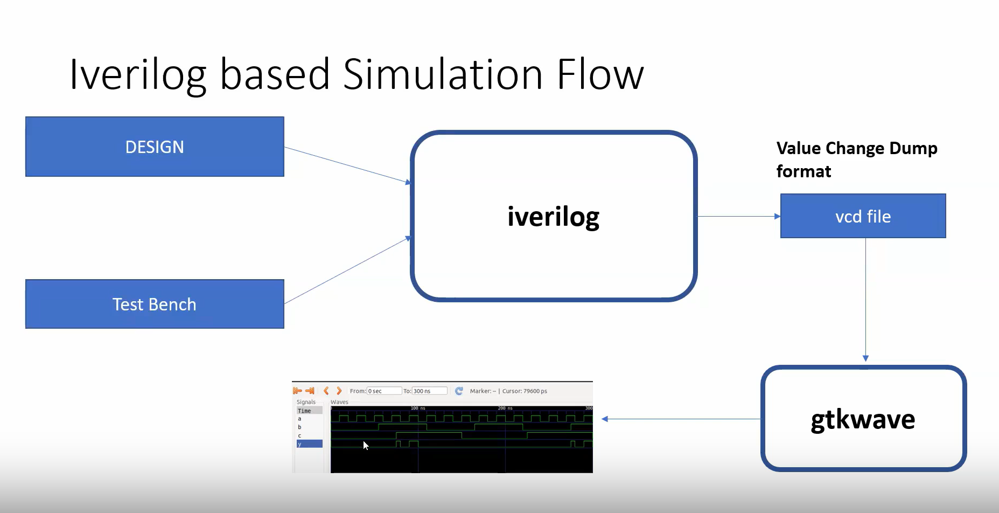

### Labs using iverilog and gtkwave
#### Inroduction to lab
1. git clone https://github.com/kunalg123/sky130RTLDesignAndSynthesisWorkshop.git/
2. Check the verilog files folder/
3. Here we will use scl_pdk_v2/stdlib/fs120/liberty/lib_flow_ff library for synthesis.

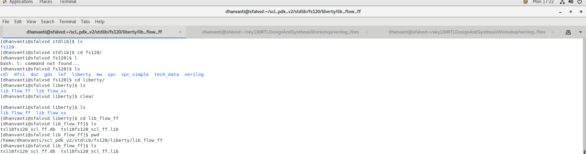
#### Introduction to iverilog and gtkwave
1. Open the terminal and navigate to the verilog files folder/
2. Load the verilog file and its testbench using ` iverilog good_mux.v tb_good_mux.v` and run the output file`a.out`
3. Open the gtkwave and load the vcd file generated by iverilog using `gtkwave tb_good_mux.vcd`

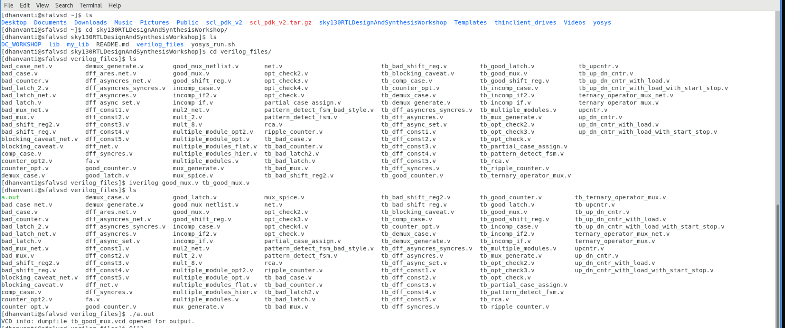\
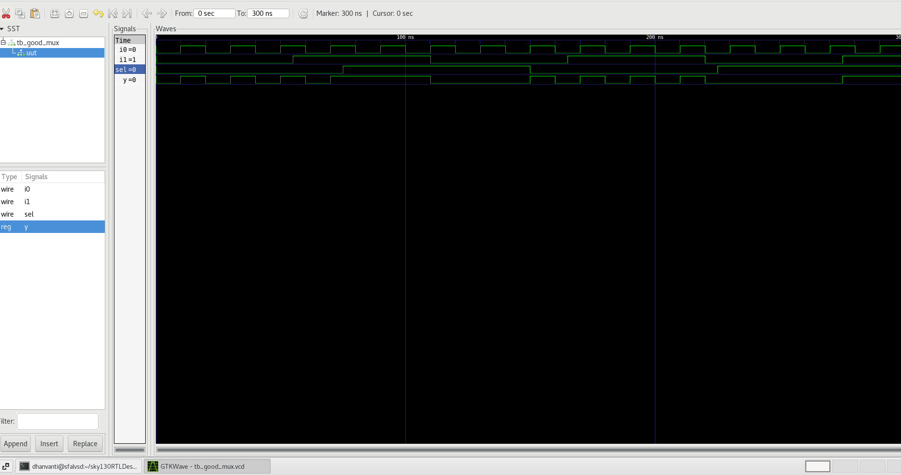

### Introduction to Yosys and logic synthesis
#### Introduction to yosys
It is an open-source tool for synthesizing digital logic, primarily from Verilog designs, into gate-level representations.

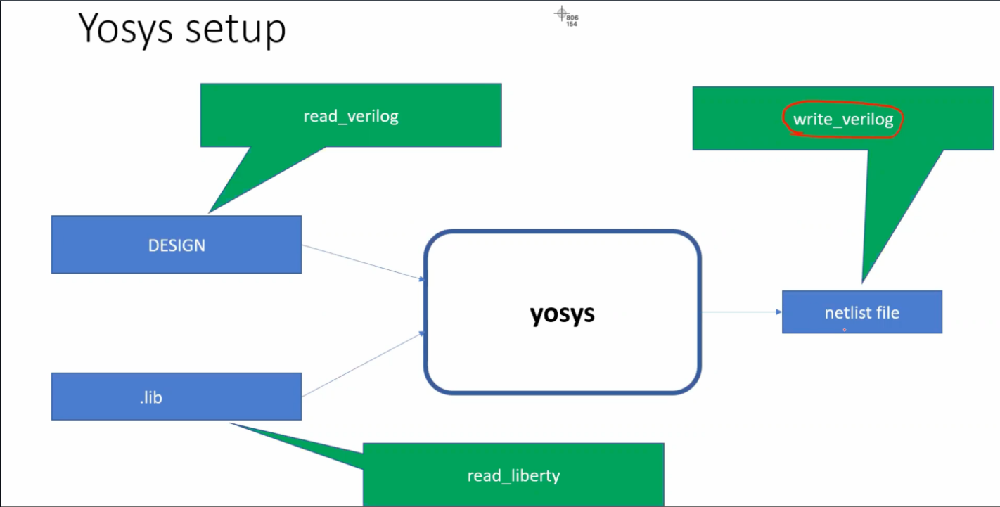

#### Introduction to Logic Synthesis
Synthesis involves
1. **Translation** - It converts HDL code(verilog) into an internal representation.
2. **Optimization** - It optimizes the design in terms of area, speed, power by simplifying gate structures.
3. It gives the Netlist cosisting of gates and there interconnection


#### Why different flavors of gate?
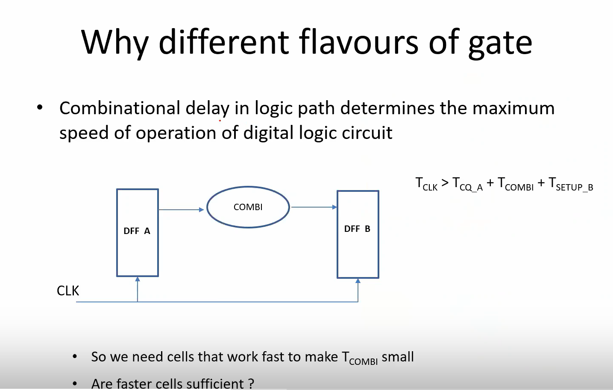

#### Why do we need Slow cells?
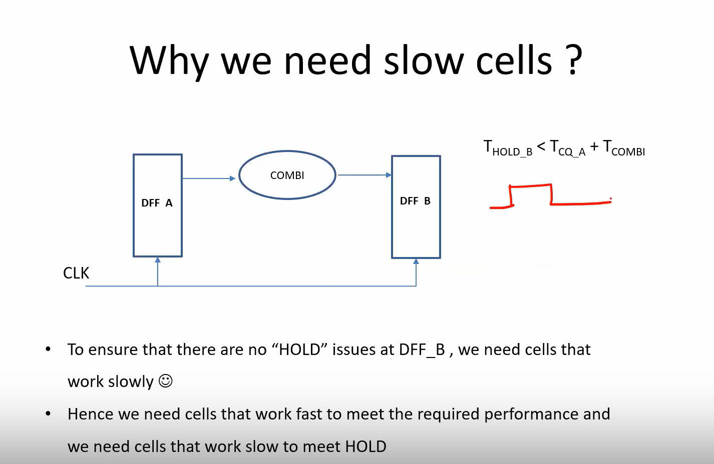

#### Faster Cells Vs Slower Cells
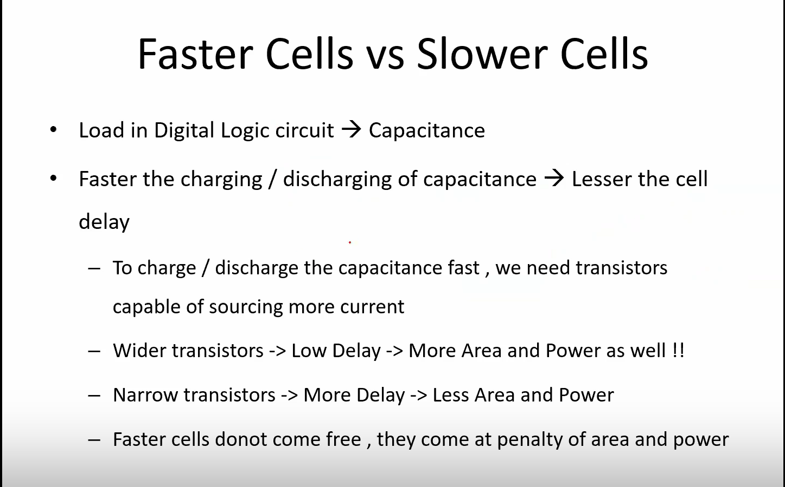

#### Synthesis Illustration
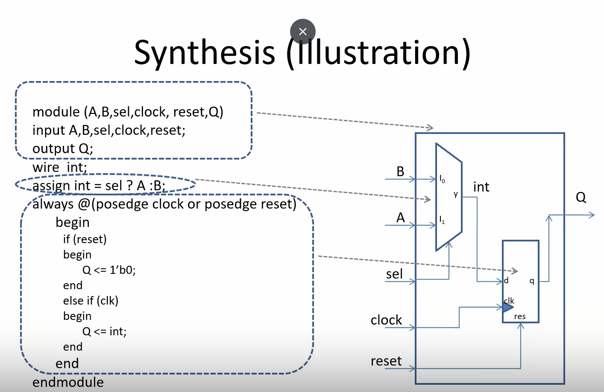


### Labs Using Yosys and scl180 PDKs
Steps
```
# Invoke yosys
yosys 

# Read liberty files
read_liberty -lib /home/dhanvanti/scl_pdk_v2/stdlib/fs120/liberty/lib_flow_ff/tsl18fs120_scl_ff.lib 

# Read verilog files
read_verilog good_mux.v

# Run synthesis on top level module
synth -top good_mux

# logic optimization using ABC algorithm
abc -liberty /home/dhanvanti/scl_pdk_v2/stdlib/fs120/liberty/lib_flow_ff/tsl18fs120_scl_ff.lib

# Write netlist file
write_verilog good_mux_netlist.v

# Write precise netlist file
write_verilog -noattr good_mux_netlist.v
```
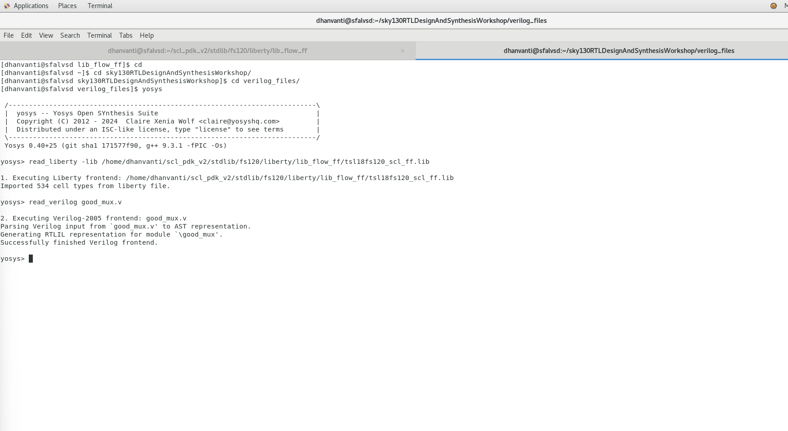

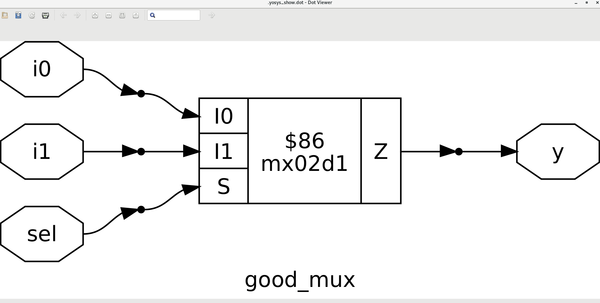


