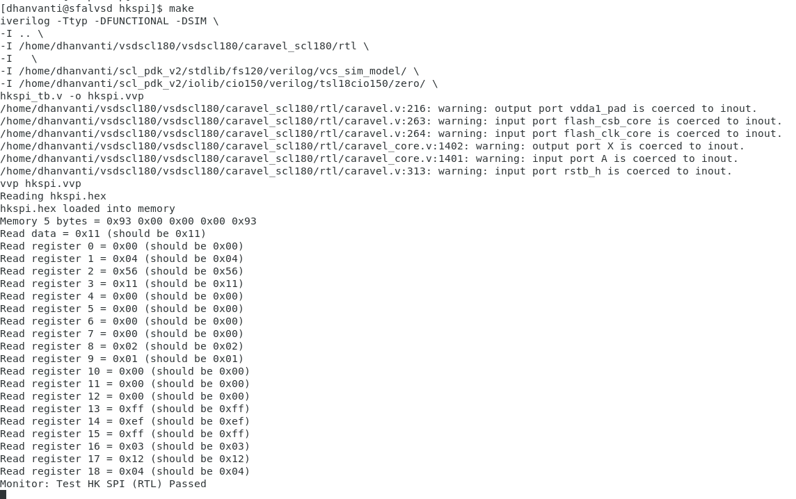
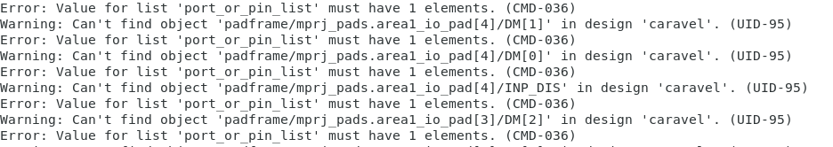

# Caravel RISC-V Core

## Overview

The **Caravel RISC-V Core** is an open-source SoC platform developed by Efabless, optimized for custom silicon prototyping on the SkyWater 130nm and 180nm nodes. 

## Repository structure
The directory structure is organized as follows:


```
vsdscl180/
├── caravel_scl180/          # Caravel project adapted for the SCL180 process node
    ├── hkspi/                # Contains various testbench files for the project
    ├── rtl/                  # Verilog files for the project's RTL design
    ├── scl180/               # Wrapper files for integrating the SCL180 node
├── caravel_130/             # Caravel project adapted for the SCL130 process node
├── synthesis/               # Scripts for setup, simulation, and synthesis
```

### Testbench 
Make sure you have installed the riscv gcc toolchain\
To install the toolchain refer this repo [link](https://github.com/stnolting/riscv-gcc-prebuilt/releases/tag/rv32e-231223)

### Run the testbench 

1. Export the variables
```
export GCC_PATH=<path_to_riscv_gcc>   # /home/dhanvanti/Downloads/riscv32/bin
export GCC_PREFIX=<gcc_prefix>        # riscv32-unknown-elf
export SCL_PDK_PATH=<path_to_scl_pdk> # /home/dhanvanti/scl_pdk_v2
```
2. Run the testbench
```
cd hkspi
make
```

### Result



### Task1
#### Download and functionally verify caravel_scl


